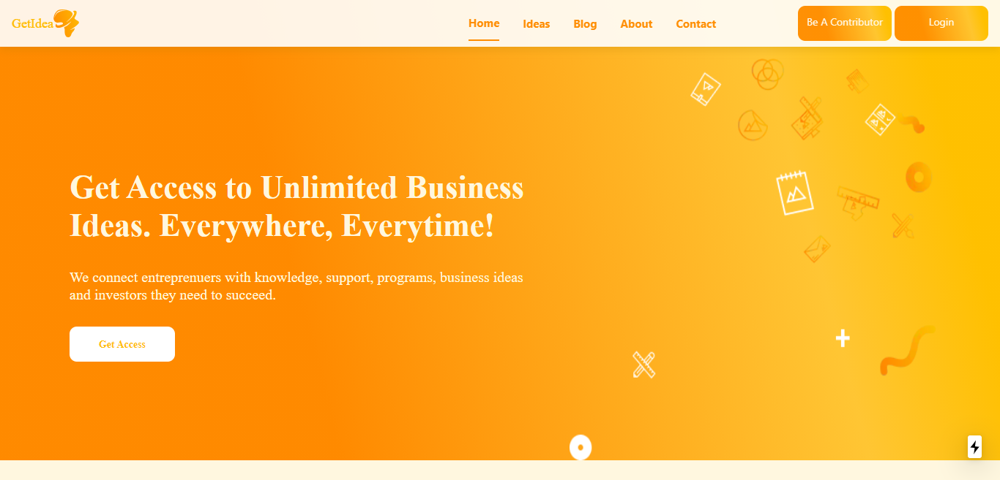

<p align="center">
  <a href="#">
     
  </a>

  <h3 align="center">GetIdea App</h3>

</p>

## Table of Contents

- [About the Project](#about-the-project)
  - [Built With](#built-with)
- [Getting Started](#getting-started)
  - [Prerequisites](#prerequisites)
  - [Installation](#installation)
- [Contributing](#contributing)
- [License](#license)
- [Contact](#contact)

## About GetApp



GetIdea App was built out of neccessity to have a one stop web app that connects entrepreneurs with knowledge, support, programs, business ideas and investors they need to succeed.

Here's why:

- A lot of web apps offers business ideas without connecting an entrepreneur with the necessary resources needed to succeed. GetIdea solves that problem and helps entrepreneurs with the neccessary tools they need.
- GetIdea app has a community where individuals can become a contributor.
- GetIdea app offers up to date information needed to help entrepreneurs start and grow their business

### Built With

List of major frameworks use to build getIdea.

- [React-Bootstrap](https://react-bootstrap.github.io/)
- [Next.js](https://nextjs.org/)
- [Expressjs](https://expressjs.com/)
- [Typescript](https://www.typescriptlang.org/)

## Getting Started

To get a local copy up and running follow these simple example steps.

### Prerequisites

- npm

```sh
npm install npm@latest -g
```

### Installation

1. Clone the repo

```sh
git clone https://github.com/calvin-puram/getIdea.git
```

2. Install NPM packages

```sh
npm install
```

3. Run Test

```sh
npm run test
```

4. Start the project in development

```sh
npm run dev
```

## Contributing

To contribute to this project follow the steps below. Any contributions you make are **greatly appreciated**.

1. Fork the Project
2. Create your Feature Branch (`git checkout -b feature/AmazingFeature`)
3. Commit your Changes (`git commit -m 'Add some AmazingFeature'`)
4. Push to the Branch (`git push origin feature/AmazingFeature`)
5. Open a Pull Request

## License

Distributed under the MIT License. See `LICENSE` for more information.

## Contact

Your Name - [@your_twitter](https://twitter.com/cpuram1) - puram.calvin@gmail.com

Project Link: [https://github.com/calvin-puram/getIdea](https://github.com/calvin-puram/getIdea)
